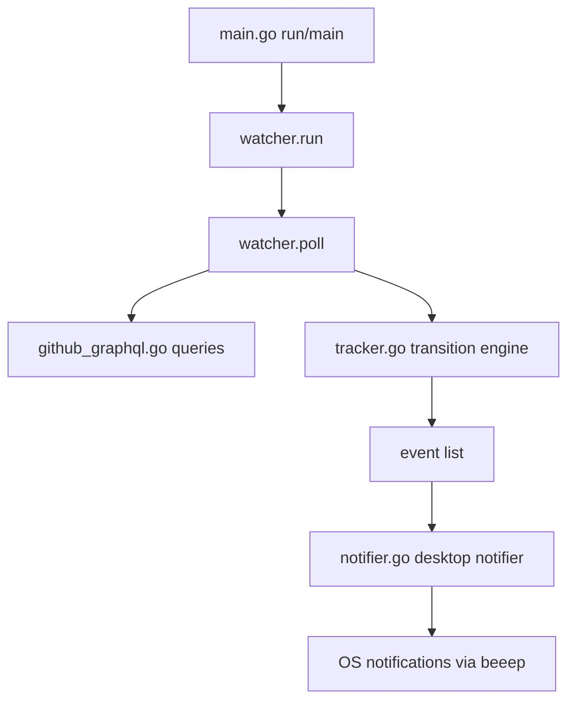

# Architecture

`gh-pulse` is a polling loop around GitHub GraphQL state snapshots and
transition detection.

## Where To Edit

| If you need to change... | Edit here |
|---|---|
| CLI flags/startup wiring | `main.go`, `app_config.go` |
| Poll cadence/rate-limit backoff loop | `watcher.go` (`run`, `poll`) |
| Which GitHub PR fields are fetched | `github_graphql.go` |
| Transition semantics (`dequeued`, `merged`, `conflict`, `checks`) | `tracker.go` |
| Notification message formatting/urgency | `watcher.go` (`buildNotification`) |
| Notification backend behavior/fallback | `notifier.go` |
| Check-context failure extraction rules | `checks.go` |

## Invariants

- Transition events are edge-triggered from previous snapshot state.
- Notification delivery errors are non-fatal to the poll loop.
- Polling respects `maxOpenPRs` by truncating and stopping further org
  fetches once the cap is reached.
